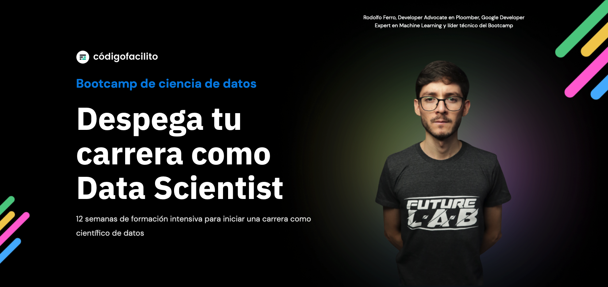

## Acerca de las sesiones

Estas clases han sido creadas para el Bootcamp de Ciencia de Datos de Código Facilito ([básico](https://codigofacilito.com/bootcamps/ciencia-datos-g2) & [avanzado](https://codigofacilito.com/bootcamps/ciencia-datos-avanzado)).

El resumen de contenidos para las clases es el siguiente:

### Bootcamp Básico

**Sección I**
- Brief histórico
- Unidad de Umbralización Lineal (TLU)
- Activación y bias – El perceptrón

**Sección II**
- Aprendizaje en neuronas
- Entrenamiento de una neurona
- Predicciones con una neurona

**Sección III – Tarea**
- El dataset a utilizar
- Preparación de los datos
- Creación del modelo
- Entrenamiento del modelo
- Evaluación y predicción

**Sección IV**

- Introducción a redes neuronales
- Productos matriciales - Composición de funciones
- Idea intuitiva sobre la retropropagación
- El problema de separabilidad lineal - XOR

**Sección V**

- Introducción a TensorFlow
- Mi primera red neuronal
- Función de pérdida y optimizador
- Entrenamiento y predicciones

**Sección VI – Tarea**

- El dataset a utilizar
- Preparación de los datos
- Creación del modelo
- Entrenamiento del modelo
- Evaluación y predicción

### Bootcamp Básico

**Sección VII**
- Refresher sobre ANNs
    - Neuronas artificiales
    - Entrenamiento
- ANNs con TensorFlow

**Sección VIII**
- Introducción a imágenes
- Espacios de color
- Convoluciones & Pooling

**Sección IX – Tarea**
- Redes convolucionales
- Clasificadores de imágenes (LeNet5, etc.)
- Descripción del reto

### Material de la clase

A continuación se presenta la tabla con los enlaces a los materiales por día:

| Contenido | Link de acceso directo |
| --------- | ---------------------- |
| Slides de la sesión 1 |  |
| Colab de la sesión 1 |  |
| Slides de la sesión 2 |  |
| Colab de la sesión 2 |  |
| --- | --- |
| Slides de la sesión 3 |  |
| Colab de la sesión 3 |  |
| Slides de la sesión 4 |  |
| Colab de la sesión 4 |  |

> **NOTA:** Los contenidos de la clase 2 serán añadidos una vez se haya impartido la sesión.

Lee más sobre el Bootcamp Básico [**AQUÍ**](https://codigofacilito.com/bootcamps/ciencia-datos-g2) y sobre el Bootcamp Avanzado [**AQUÍ**](https://codigofacilito.com/bootcamps/ciencia-datos-avanzado).

